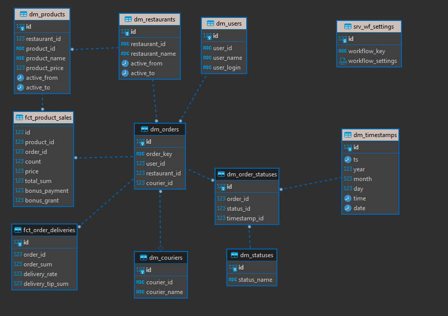

1. Список полей, которые необходимы для витрины.
 - id 
 - courier_id 
 - courier_name 
 - settlement_year 
 - settlement_month 
 - orders_count 
 - orders_total_sum 
 - rate_avg 
 - order_processing_fee 
 - courier_order_sum 
 - courier_tips_sum 
 - courier_reward_sum 

2. Список таблиц в слое DDS, из которых вы возьмёте поля для витрины. Отметьте, какие таблицы уже есть в хранилище, а каких пока нет. Недостающие таблицы вы создадите позднее. Укажите, как они будут называться.

dm_timestamps - Уже есть, необходимо модифицировать
fct_order_deliveries - Необходимо создать
dm_couriers - Необходимо создать
dm_orders - Уже есть, необходимо модифицировать
dm_order_statuses - Необходимо создать
dm_statuses - Необходимо создать

3. На основе списка таблиц в DDS составьте список сущностей и полей, которые необходимо загрузить из API. Использовать все методы API необязательно: важно загрузить ту информацию, которая нужна для выполнения задачи.

dm_couriers
 - ID - автоинкремент
 - courier_id - id курьера
 - courier_name - ФИО курьера 

dm_orders модифицирован
- удалены timestamp_id, order_status
- добавлен courier_id

dm_statuses - хранит уникальные значения статусов заказа
- id
- status_name - наименование статуса

dm_order_statuses - хранит данные обо всех статусах заказов со ссылкой на дату/время. Таблица была добавлена для возможности вытащить дату/время создания заказа для витрины курьеров
- id 
- order_id - FK на dm_orders
- status_id - FK на dm_statuses
- timestamp_id - FK на dm_timestamps

dm_timestamps - etl процесс был модифицирован, теперь в таблицу подгружаются timestamps всех статусов заказов, а не только конечные дата/время

fct_order_deliveries - таблица фактов для хранения расчитываемых показателей из delivery_system_deliveries
- id
- order_id - id заказа, FK на dm_orders
- order_sum - сумма заказа
- delivery_rate - оценка за заказ
- delivery_tip_sum - сумма чаевых

